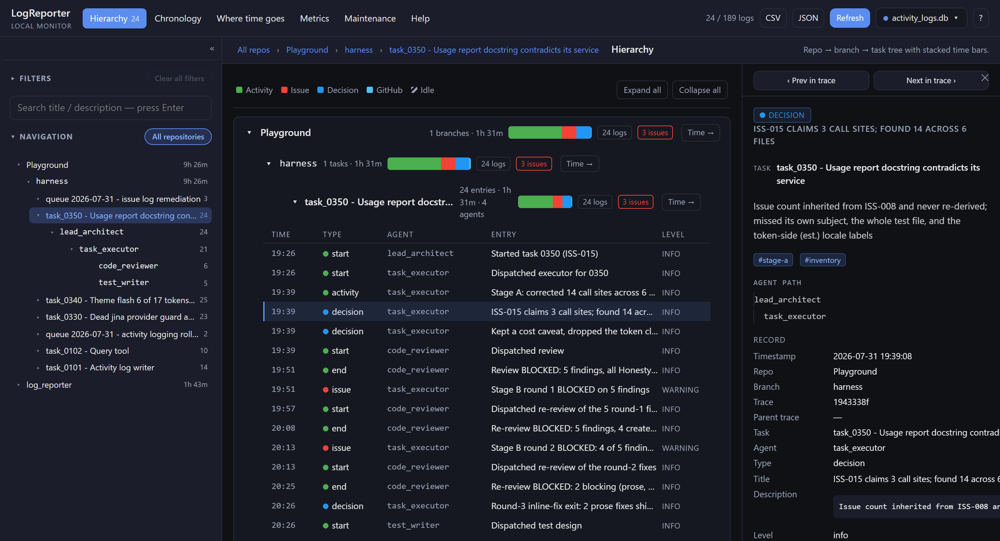

# LogReporter

**See what your AI coding agents actually did — and where the time went.**

LogReporter is a local dashboard over a single SQLite file. Your agents append one row per meaningful step as they work; the dashboard reads that file in the browser and turns it into a hierarchy, a chronology, a time breakdown, metrics, a model rate card, and a maintenance view. No server-side database, no telemetry, no account — the file never leaves your laptop.



It is built for the multi-repo, multi-agent case: a lead architect and its subagents, working across several repositories, all appending to **one** `activity_logs.db`. One prompt works in every repo — the writer derives the repository and branch from git in whatever directory the agent is standing in.

> **Use at your own risk.** LogReporter is provided as is, with no warranty of any kind. It reads and deletes data on your machine and reports numbers you may act on. See [Disclaimer](#disclaimer).

---

## Table of contents

- [What you get](#what-you-get)
- [Requirements](#requirements)
- [Quick start](#quick-start)
- [Point your agents at it](#point-your-agents-at-it)
- [Customizing `log_activity.py`](#customizing-log_activitypy)
- [Customizing the agent prompts](#customizing-the-agent-prompts)
- [Everyday use](#everyday-use)
- [Troubleshooting](#troubleshooting)
- [How it works](#how-it-works)
- [Project layout](#project-layout)
- [The sponsor strip](#the-sponsor-strip)
- [Disclaimer](#disclaimer)

---

## What you get

| Page | The question it answers |
| --- | --- |
| **Hierarchy** | What work exists, and how does it nest? Repository → branch → task → log entries. |
| **Chronology** | What happened, in the order it happened — including the stretches when nothing was logged. |
| **Where time goes** | Where the wall-clock time went: which agent, which category, and how much was nobody working. |
| **Metrics** | Counts, distributions, and the issues still open — plus what the work cost in tokens and money. |
| **Models & pricing** | What every model costs per million tokens, and every pricing tier behind that. |
| **Maintenance** | What is stored; delete or export part of it. |

Every page has a full guide built in — click **Help** in the header, or **?**.

---

## Requirements

- **Python 3.8+** — standard library only, nothing to `pip install`.
- **A modern browser.** Chromium-based (Chrome, Edge, Brave) is recommended: it supports file handles, which is what lets *Auto-poll* re-read a database you picked by hand. Firefox and Safari work; you just press *Refresh* instead.
- **Internet on first load** — the SQLite engine (`sql.js`) is fetched from a CDN. See [Running fully offline](#running-fully-offline) if that is not acceptable.
- **git** on `PATH` — optional, but it is what makes repository and branch auto-detection work.

Works on Windows, macOS and Linux. The only Windows-specific file is the `start_LogReporter.bat` convenience launcher; everything else is plain Python.

---

## Quick start

### 1. Clone

```bash
git clone https://github.com/frenamezian/logreporter.git
cd logreporter
```

### 2. Create the database

The live `activity_logs.db` is deliberately **not** in git — it is runtime data that several agents write to continuously, and tracked binary diffs would be unmergeable. So a fresh clone has no database until you make one. Pick one of these:

**A — start from the bundled sample** (148 rows across three repositories, so every page has something in it; good for a first look):

```bash
bash seed/init_db.sh
```

**B — start empty** (what you want for real use):

```bash
python seed/new_db.py
```

Either way you end up with `activity_logs.db` in the repository root, in WAL mode so several agents can write while the dashboard reads. You can also start from the sample and clear it later from the **Maintenance** page.

### 2b. Protect it

```bash
git config core.hooksPath .githooks
```

Enables a `pre-commit` guard that refuses to commit `activity_logs.db` or `token_usage.db`. It is per-clone config, so a fresh clone needs it again.

Two protections are already in place:

- **Neither database is in `.gitignore`.** Git silently overwrites an *ignored* file when a checkout wants to write one there, and refuses outright for an untracked, unignored one. Eleven commits in this repository's history still carry an old copy of `activity_logs.db`, so that is a live hazard — it destroyed a live database once. Unignored, the checkout aborts instead. The cost is one line each in `git status`, which the hook above keeps harmless.
- **`serve.py` snapshots both** into `backups/` on every start and before every destructive operation, keeping the last ten of each. It uses SQLite's online backup API, so a snapshot taken while a database is being written to is still consistent.

### The two databases, side by side

Protected **identically**. They differ in what a loss costs, and the protections deliberately ignore that, because a rule with a per-file exception is a rule that gets applied wrong.

| | `activity_logs.db` | `token_usage.db` |
| --- | --- | --- |
| Holds | one row per logged step | one row per API request |
| Written by | `log_activity.py`, continuously | `usage_reader.py`, on demand |
| Created by | `seed/new_db.py` | `seed/new_usage_db.py` |
| If lost | **gone — unreconstructable** | rebuilt from transcripts in seconds |
| In `.gitignore` | no | no |
| Commit guard | yes | yes |
| Snapshotted | on start + before every delete | on start + before every rebuild |
| Destructive UI action | **Delete** (Maintenance) | **Rebuild usage** (Maintenance) |

The one asymmetry worth knowing: the `watermark` table inside `token_usage.db` records how far the reader got through each transcript. Losing it costs no data, but turns the next import into a full re-read of every session file on the machine — which is why *Rebuild usage* snapshots first, exactly as a delete does.

### 3. Start the dashboard

```bash
python serve.py            # any OS  → http://127.0.0.1:8250/index.html
```

On Windows you can double-click **`start_LogReporter.bat`** instead — same thing, plus it opens your browser for you.

> **Do not open `index.html` by double-clicking it.** On a `file://` origin the browser's `fetch()` cannot read `activity_logs.db` at all, and the dashboard silently falls back to demo data. It must be served over `http://`.

`serve.py` binds to `127.0.0.1` only — nothing is exposed to your network. It serves the static page *and* provides the one write endpoint the Maintenance page needs to make deletes stick.

### 4. Check it works

Open <http://127.0.0.1:8250/index.html>. The button at the top right should read **activity_logs.db** with a lit dot, and the header should show a row count. If it says *Demo data*, see [Troubleshooting](#troubleshooting).

---

## Point your agents at it

This is the part that matters. The goal: **every agent in every repo appends to the one `activity_logs.db` in your LogReporter clone.**

### The one rule

Agents call `log_activity.py` **by absolute path**, from whatever directory they happen to be working in.

`log_activity.py` writes to the `activity_logs.db` sitting next to *itself*, not next to the caller. That is the whole mechanism: one canonical copy of the writer, one canonical database, and any number of repos calling into it.

### Step 1 — get your absolute path

```bash
# from inside your logreporter clone
python -c "import os; print(os.path.abspath('log_activity.py'))"
```

Examples — substitute yours everywhere `<LOGGER>` appears below:

| OS | Looks like |
| --- | --- |
| Windows | `C:/Users/you/dev/logreporter/log_activity.py` |
| macOS | `/Users/you/dev/logreporter/log_activity.py` |
| Linux | `/home/you/dev/logreporter/log_activity.py` |

> Forward slashes work fine on Windows and avoid backslash-escaping headaches inside prompts.

### Step 2 — smoke-test it from another repo

Stand in a *different* repository and write one row:

```bash
cd ~/dev/some-other-project
python <LOGGER> --sync --log-type start \
  --task "Smoke test" --agent me --log-title "Hello from another repo"
```

It prints a row id. Now refresh the dashboard: a new node appears under **that repository's name and current branch** — you never passed either. That is `--repo` and `--branch` auto-deriving from git in the caller's working directory, and it is why one prompt works everywhere.

```
some-other-project              ← repo name, from git
  └ feat/whatever-you-are-on    ← current branch, from git
      └ Smoke test              ← --task
          └ me                  ← --agent
```

Delete the test row from the **Maintenance** page when you are done.

### Step 3 — give your lead agent the orchestrator prompt

Paste the contents of **[`orchestrator_logging_instructions.md`](orchestrator_logging_instructions.md)** into your lead agent's system prompt, with two edits:

1. Replace every `python log_activity.py` / `python mint_trace.py` with the **absolute** path.
2. That is the whole edit. The shipped files pass no `--repo` or `--branch`, so git fills both in correctly, per repo, per branch, with no editing. (They used to hardcode `--repo logreporter --branch main`, which is how this project's own token usage came to be attributed to a repository that existed on only one side of the join.)

Here is the portable form, ready to paste (replace `<LOGGER>` and `<MINTER>`):

````markdown
## Activity logging (mandatory)

You are the **lead architect** — the root agent. You own trace identity for the
whole run. Log every meaningful step to LogReporter as you work.

### Tools (absolute paths — call them from wherever you are)

    python <MINTER>                    # mint a trace_id — YOU ONLY, never a subagent
    python <LOGGER> --log-type <type> --task "<title>" \
      --agent <name> --agent-path <lineage> --trace-id <id> \
      --log-title "<one specific line>" [--log-description "..."] \
      [--log-level info] [--status in_progress] [--priority medium] \
      [--tags "#x #y"] [--error-details "..."] [--commit-reference <sha>]

Required: `--log-type`, `--log-title`, `--agent`. **Do not pass `--repo` or
`--branch`** — they are derived from git in your working directory, which is
what makes one prompt work in every repository. The call is synchronous: it
validates, writes the row, prints its id and returns — so if it returned
successfully, the row is in the database.

### Bracket every task

- First action on a task: a `start` row.
- Last action, always, even on failure: an `end` row with the final `--status`
  (`completed` or `failed`). Durations and idle time are derived from this
  pair — a missing `end` erases everything after your last log from every time
  view.

### Between the brackets, one row per meaningful step

- `activity` — what you did (a file read, a build, an edit).
- `decision` — a choice between alternatives; record the alternatives and why
  you rejected them, not just the outcome.
- `issue` — a failure, retry or block; put the raw error in `--error-details`.
  When it is fixed, log a follow-up `issue` row with `--resolved-by` set.
- `github` — any git operation; tag it `#pull #push #commit #add #delete`. For
  a commit, pass `--commit-reference <full 40-char sha>` and title it
  `"commit <short sha>: <subject>"`.

### Trace identity — you own it

Mint one trace per task with `<MINTER>` and reuse it for **every** row of that
task, yours and your subagents'. Pass it to every subagent you dispatch; the
subagent uses it verbatim and sets `--parent-trace-id` to it. Never mint a
trace per subagent, per row or per tool call — the trace timeline is how a
multi-agent run reads as one sequence.

### When you dispatch a subagent

Include the subagent logging block in its prompt with `<name>`, `<trace_id>`,
`<parent_trace_id>` and `<task_title>` filled in. `task_title` must be
identical, character for character, across every row of one task — it is a
grouping key.

Do NOT log per token, per line or inside tight loops. One row per step a human
would want to see. Silence between rows is reported as idle time, so log before
you start waiting on something slow.
````

### Step 4 — give subagents the subagent prompt

Same treatment for **[`subagent_logging_instructions.md`](subagent_logging_instructions.md)**: absolute path, no `--repo`/`--branch`. The lead fills in the placeholders when it dispatches:

| Placeholder | Filled in with | Example |
| --- | --- | --- |
| `<name>` | the subagent's `--agent` | `code_reviewer` |
| `<lineage>` | its `--agent-path` | `lead_architect/task_executor/code_reviewer` |
| `<trace_id>` | the lead's trace, verbatim | `9f2c41a8` |
| `<parent_trace_id>` | the lead's trace | `9f2c41a8` |
| `<task_title>` | the lead's exact task title | `task_0350 - Fix docstring` |

`--agent-path` is what builds the agent tree and the waterfall's indentation, and it is how "own time" (a parent's span minus its subagents' runs) is computed. Get the lineage right and the time breakdown is right.

### A worked multi-repo example

Three repos, one database, no per-repo configuration:

```bash
# terminal 1 — the dashboard, running all day
cd ~/dev/logreporter && python serve.py

# an agent working in ~/dev/api
python /home/you/dev/logreporter/log_activity.py --log-type start \
  --task "Add rate limiting" --agent lead_architect --agent-path lead_architect \
  --trace-id 9f2c41a8 --log-title "Started rate limiting" --status in_progress

# its subagent, same task, same trace, deeper path
python /home/you/dev/logreporter/log_activity.py --log-type decision \
  --task "Add rate limiting" --agent handler_dev \
  --agent-path lead_architect/handler_dev \
  --trace-id 9f2c41a8 --parent-trace-id 9f2c41a8 \
  --log-title "Token bucket over sliding window" \
  --log-description "Sliding window needs per-key history; bucket is O(1) and good enough at our QPS"

# a different agent, in ~/dev/web, a different task and trace
python /home/you/dev/logreporter/log_activity.py --log-type activity \
  --task "Dark mode" --agent lead_architect --agent-path lead_architect \
  --trace-id 4d10be77 --log-title "Extracted colour tokens"
```

The dashboard shows:

```
api                                   ← auto-derived
  └ main
      └ Add rate limiting
          └ lead_architect
              └ handler_dev
web                                   ← auto-derived
  └ feat/dark-mode
      └ Dark mode
          └ lead_architect
```

Turn on **Auto-poll** in the data-source menu and the tree fills in while the agents work.

---

## Customizing `log_activity.py`

### Where the database lives

`DB_PATH` is resolved next to the script:

```python
DB_PATH = os.path.join(os.path.dirname(os.path.abspath(__file__)), "activity_logs.db")
```

To put the database somewhere else — a synced folder, an SSD, outside the clone — make it configurable:

```python
DB_PATH = os.environ.get(
    "LOGREPORTER_DB",
    os.path.join(os.path.dirname(os.path.abspath(__file__)), "activity_logs.db"),
)
```

Then set `LOGREPORTER_DB` for your agents. Note that **`serve.py` still serves the file next to itself**, so if you move the database, either symlink it back into the clone or change `DB_PATH` in `serve.py` to match. Keeping them together is simpler.

### Repository and branch detection

`detect_repo_and_branch()` makes one `git rev-parse` call, reads the remote out of the git directory it points at, and handles the cases that would otherwise scatter your data:

| Situation | What you get |
| --- | --- |
| Normal checkout | the **origin remote's** repository name, and the current branch |
| Folder renamed, or never named after the repo | still the remote's name — `log_reporter/` on disk logs as `logreporter` |
| Linked worktree | the **main** repo's name, so worktrees stay one node instead of several |
| Per-task clone in its own folder | the repo it was cloned from, not the folder |
| Submodule | the submodule's own name, not `modules` |
| Detached HEAD | branch reads `detached` rather than being blank |
| No remote configured | the folder holding `.git`, with the worktree and submodule rules above |
| Not a git repo | the directory's name, and no branch |

**The repo name comes from the remote, not the folder**, because the folder name is a local accident — chosen at clone time, never resynchronised, and different for every worktree. Token-usage attribution joins on this name, and the usage reader can only observe the checkout a transcript recorded; the remote is the one identity both sides see. `parsers/_gitname.py` implements the same rule for parsers, and the two must agree exactly or the join yields zeroes rather than approximations.

**Neither is an agent's to choose, so neither is part of the tool's surface.** `--repo` and `--branch` do not appear in `--help` or in either agent prompt. They are still accepted, and they are outranked: git wins whenever git can answer, and a passed value is used only for a directory git knows nothing about — one that has never been `git init`-ed.

The ordering is what keeps the two databases joinable. `repo_name` is a key shared with a reader that never sees `activity_logs.db`: it derives the repo from the remote of the checkout a transcript recorded, so the only value that can match is the one git reports. A declared name does not relabel the work, it detaches it, and the task then renders as having cost nothing rather than as an error. That is not a hypothetical — it is how this project's own 76M tokens went missing.

They remain accepted rather than rejected because prompts hardcoding `--repo <name>` are in circulation, and `argparse` would exit 2 on them: a wrong repo name would become no logging at all, against the one database here that nothing can reconstruct. Such a call now writes the correct row and leaves a line in `log_activity_errors.log` naming the caller to fix.

### Synchronous vs asynchronous

Synchronous is the default: the `INSERT` completes before the call returns, the new row id is printed, and a failure exits non-zero and says why. A row you were told was written is a row that exists.

It was asynchronous until an agent lost five rows to it. Its terminal ran the shell inside a job object that killed every descendant when the subshell closed, so each detached writer died before SQLite committed — and each call had already exited 0. The documented safety net, `log_activity_errors.log`, was never written: a killed process cannot report its own death, which is precisely why the most likely failure was also the quietest one.

Re-logging afterwards does not undo it. The rows come back with the time they were re-written, so the task's span collapses to a few seconds — and a span is what token usage is attributed to and what durations and idle time are derived from. In that incident 129 of 132 requests ended up attributable to nothing, permanently, because the real event times were never recorded anywhere.

`--async` restores the old behaviour for a caller that wants it, and on Windows it now asks to break away from the parent's job object before falling back to a plain detached spawn. `--sync` is still accepted and does nothing, so existing agent prompts keep working.

### Other knobs

| What | Where | Default |
| --- | --- | --- |
| `user_id` on every row | `--user-id`, or the default in `main()` | `admin` |
| Lock retry policy | `MAX_RETRIES`, `INITIAL_BACKOFF` | 5 tries, 0.25s doubling |
| SQLite busy timeout | `connect()` | 10s |
| WAL checkpoint after write | `_checkpoint()` | `PASSIVE` |

The `PASSIVE` checkpoint is what makes a new row visible to the dashboard promptly: the page fetches the raw `.db` bytes over HTTP and `sql.js` cannot see a `-wal` sidecar. Escalate to `TRUNCATE` only if you see `-wal` growth — it blocks, `PASSIVE` does not.

### Adding a column

The schema is one table, `logs`. If you add a field, four places need to agree:

1. `ALTER TABLE logs ADD COLUMN your_field TEXT;` on the database.
2. `COLUMNS` in `log_activity.py`, plus an `add_argument` and an entry in `row_values()`.
3. `SCHEMA_COLS` and `SCHEMA_SQL` in `script/db.js` (used for demo data and exports).
4. The `rows` array in `components/log-details.js`, so it appears in the record grid — and `exportRows`' column list in `script/app.js` if it should reach CSV.

The dashboard reads with `SELECT *`, so an unknown column is carried through harmlessly; it just will not be displayed until step 4.

---

## Customizing the agent prompts

The two instruction files are meant to be **copied into your agents' prompts**, not imported. Adapt freely — but a few things are load-bearing, because the dashboard derives everything from them.

### Change these to fit your setup

- **The tool paths.** Absolute, always.
- **Nothing about the repo or branch.** git supplies both; the prompts do not mention them.
- **Agent names and lineage.** `lead_architect` is just this project's convention. Use whatever your roles are called; only the `/`-separated lineage shape matters.
- **Task titles.** Whatever unit of work makes sense — a ticket id, a phase, a feature. One title per task.
- **Tags.** Free-form `#tokens`. The only ones the UI reads are the git actions on `github` rows: `#pull #push #commit #add #delete`.
- **The `UPDATE_PLAN.md §16` references** at the bottom of both files — that document is specific to this repository's own build history. Point them at your own contract, or delete the line.

### Do not change these

| Rule | Why |
| --- | --- |
| Every agent writes a `start` row and an `end` row | Every duration and every idle gap is derived from that pair. No `end`, no time. |
| `repo_name` + `branch_name` + `task_title` identical across a task, character for character | They are the grouping key. A title that drifts by one space becomes two tasks with two wall clocks. |
| `agent_path` is the real lineage | It builds the agent tree, the waterfall indentation, and the parent-minus-children "own time" correction. |
| One `trace_id` per task, minted by the lead, reused by every subagent | The trace timeline is how a multi-agent run reads as one sequence. A trace per subagent detaches the work. |
| Log before waiting on something slow | Silence is reported as idle time. That is the honest reading — but it is only useful if agents mark the difference between waiting and being finished. |
| `log_type` stays within `start end activity issue decision github` | The five categories are hard-coded in the colour scheme and the time model. |

### Tuning how much agents log

Too little and the timeline is a straight line from `start` to `end`. Too much and the file grows without telling you more. The rule that works: **one row per step a human would want to see** — never per token, per line, or inside a loop.

If your agents under-log, the symptom is obvious on **Where time goes**: a huge single segment, or a large idle share on a task you know was busy. If they over-log, the Chronology page hits its 500-row cap constantly.

---

## Everyday use

- **Leave `serve.py` running** in a terminal all day and keep a browser tab open.
- **Turn on Auto-poll** (data-source menu) while agents are working — it checks every five seconds.
- **Press Refresh** after a burst of work if you left Auto-poll off; it re-reads from the source, not from the copy in memory.
- **Prune from the Maintenance page.** It uses the same filters and drill scope as the rest of the app, shows exactly what will go, and asks before deleting. Deletes are executed against the real file by `serve.py` — they persist.
- **Back up** by copying `activity_logs.db`, or with **Save database copy** in the data-source menu.

The database grows by a few hundred bytes per row, more if your agents write long descriptions. Tens of thousands of rows are not a problem: the dashboard reads once per load and computes every view in memory.

---

## Troubleshooting

| Symptom | Cause and fix |
| --- | --- |
| Header says **Demo data** | The page is not being served over `http://`, or `activity_logs.db` is missing. Start it with `python serve.py` and check the file exists. |
| `activity_logs.db not found at …` from an agent | The database was never created. Run `bash seed/init_db.sh`, or the empty-database snippet in [Quick start](#quick-start). |
| Agent says it logged, nothing appears | Async writes report failures to `log_activity_errors.log` next to the database. Check it. Re-run the same call with `--sync` to see the error directly. |
| Rows land under the wrong repository | The agent's working directory is not what you think — `cd` into the right checkout before logging. If a caller passes `--repo`, git overrides it and says so in `log_activity_errors.log`. |
| A task shows huge idle time | Something ran without logging, or an `end` row never arrived. Both are real findings, not display bugs. |
| Deleting does nothing / says **NOT saved** | The page is being served by something other than `serve.py` (e.g. `python -m http.server`), so the delete endpoint is missing. Use `serve.py`. |
| Nothing renders, console shows a CDN error | `sql.js` could not be fetched. See below. |
| Port 8250 is busy | `python serve.py 9000` — any port works. |

### Running fully offline

Download `sql-wasm.js` and `sql-wasm.wasm` (sql.js 1.10.3), drop them next to `index.html`, and point the two constants at the top of `script/db.js` at the local copies. That is the only remote dependency in the project.

---

## How it works

```
your agents (any repo)  ──►  log_activity.py  ──►  activity_logs.db
                                                        │
                                        serve.py serves the bytes over http
                                                        ▼
                                 sql.js parses them in the browser
                                                        │
                          filters + drill scope ──► rows in scope
                                 time model ──► runs, segments, gaps, totals
                                                        ▼
                                     five pages + the detail panel
```

The database is read once per load or poll and never queried per view — every page is a pure function of the rows held in memory. Durations are never stored; they are derived from the `start`/`end` pairs each time the page is drawn, so any log file produces the same numbers.

The in-app **Help** page documents all of it: a user guide per page, and a developer guide covering the architecture, the data model, the duration and idle model, the page layouts, and the agent logging contract.

### Token usage — a second, disposable database

The Metrics page also reports how many tokens each task consumed and what it cost. That data is *observed*, not logged: `usage_reader.py` reads the session transcripts your coding agents already write, so it works on history that predates the feature and your agents were never asked to do anything.

```
~/.claude/projects/**.jsonl  ──►  parsers/<agent>.py  ──►  token_usage.db
   (whatever your agent writes)         one file per agent           │
                                                    serve.py serves it too
                                                                     ▼
                                            joined to the logs in memory, in JS
                                                cost derived from llm_registry.js
```

The **Models** page is the other half of that last line: `llm_registry.js` as a browsable rate card. One expandable panel per provider, one row per model with its standard and cache prices in both directions, and every remaining tier — batch, flex, priority, long-context, fast mode — one click further in. It is the only page that reads no logs at all, and the only place to check what the cost figures on Metrics are actually being computed from.

**Only `activity_logs.db` matters for backup.** It is append-only ground truth that several agents write to continuously, and nothing can reconstruct it. `token_usage.db` is a cache: delete it, run `python usage_reader.py`, and you are exactly where you started — which is why it is a sibling file rather than a table inside the log database, and why **Rebuild usage** on the Maintenance page is safe.

Cost is never stored. It is computed at render time from `script/llm_registry.js`, the same way durations are derived rather than stored — a saved cost silently becomes a lie the day prices change. Cost is **modelled, not billed**: on a Pro or Max subscription these tokens draw against a plan, so it is a comparison figure, not an accounting one.

Supporting a new agent means **adding one file to `parsers/`** and nothing else — there is no registration list. See [parsers/CONTRIBUTING.md](parsers/CONTRIBUTING.md).

---

## Project layout

```
index.html                index.html loads everything; no build step
style.css                 all styling; design tokens at the top
serve.py                  static server + the delete endpoint (127.0.0.1 only)
start_LogReporter.bat     Windows convenience launcher
LICENSE                   MIT

log_activity.py           the writer your agents call — one row per invocation
mint_trace.py             mints a trace_id (lead agent only)
usage_reader.py           reads agent transcripts into token_usage.db (a cache)
orchestrator_logging_instructions.md   paste into your lead agent's prompt
subagent_logging_instructions.md       paste into each subagent's prompt

script/
  time-model.js           runs, segments, gaps, task/branch/repo totals
  filters.js              filtering and drill scope
  db.js                   sql.js loading, open/read/delete/export
  app.js                  application state
  cost-model.js           prices usage rows from the registry, at render time
  model-catalog.js        the Models page's view of that registry
  llm_registry.py         model + price registry — EDIT THIS ONE
  llm_registry.js         generated from it by seed/py2js_registry.py
parsers/                  one file per supported agent; auto-discovered
  CONTRIBUTING.md         how to add an agent — one new file, nothing else
  conformance.py          `python -m parsers.conformance` — required to pass
components/               one custom element per page and panel
fonts/                    Archivo, vendored (one variable woff2) — the light
                          theme's chrome titles; no network fetch, ever
docs/                     the in-app help fragments, plus screenshots
docs/lespirant/           sponsor strip: ads.json + the banner images
seed/                     sample database, bootstrap and authoring tools
  validate_palette.js     chart colours are computed, not chosen
  render_mermaid.py       docs/img/*.mmd → the checked-in SVG
site/                     the landing page and the live demo — source, not output
  build.py                assembles it into the gitignored site/_build/
  publish.py              publishes that to the gh-pages branch
```

---

## The sponsor strip

The band across the bottom of the app carries rotating banners for [LESPIRANT](https://www.lespirant.com), which funds this project. It is capped at 9% of the window height and pauses whenever you hover it.

It is driven entirely by `docs/lespirant/ads.json` — no code:

```json
{
  "label": "LESPIRANT",
  "link": "https://www.lespirant.com",
  "rotateMs": 7000,
  "ads": [
    { "img": "ad-01.png", "alt": "…", "href": "https://www.lespirant.com/products/lcut-undershirt" }
  ]
}
```

| To… | Do this |
| --- | --- |
| Run your own ads | Drop `1600 × 200 px` images in `docs/lespirant/` and list them in `ads.json`. |
| Change the rotation speed | `rotateMs` (minimum 2000). |
| Reduce it to a text credit | Empty the `ads` array. |
| Remove it entirely | Delete `docs/lespirant/ads.json`, or drop `<log-footer>` from `script/app.js`. |

Banners are regenerated by `docs/lespirant/build_ads.py`, which composes them from photography on lespirant.com. Note that it re-downloads those source images at runtime, so it depends on those CDN URLs still resolving.

---

## Disclaimer

**LogReporter is provided as is, without warranty of any kind, express or implied. You use it at your own risk.** I do my best to make it correct and to keep the numbers honest, but it is a young project written largely alongside the agents it reports on, and it will have bugs.

Four specific things to be aware of, because they are the ones that can actually cost you something:

| | |
| --- | --- |
| **It deletes data, permanently** | The Maintenance page runs real `DELETE` statements against `activity_logs.db` through `serve.py`. There is no undo and no recycle bin. Back the file up before pruning — copy it, or use **Save database copy** in the data-source menu. |
| **Costs are modelled, not billed** | Token costs are computed from a local price registry, not from any invoice. They are an API-pricing equivalent, useful for comparison and wrong as an accounting figure — on a subscription plan those tokens draw against your plan instead. Prices also go stale between registry refreshes. Never use these numbers for billing, chargeback, or budgeting decisions without checking them against your provider. |
| **The numbers are only as good as the logging** | Durations, idle time and own time are derived from the `start`/`end` rows your agents write. An agent that skips its closing row, or drifts on a task title, produces a timeline that is wrong rather than merely incomplete. A large idle share may be a real finding or an under-logging agent, and LogReporter cannot tell you which. |
| **It reads files that contain your secrets** | The usage reader walks the transcripts your coding agents write, which hold source code, prompts, and anything else that passed through a session. It extracts only numeric counters and repository/branch names — but if you point it somewhere unexpected, or publish a database, that is the material nearby. |

Nothing here is sent anywhere: no telemetry, no account, no upload. That also means nothing is backed up for you.

If you find a bug — especially one where a number is wrong rather than missing — please [open an issue](https://github.com/frenamezian/logreporter/issues). Wrong numbers are worse than absent ones, and they are the bugs I most want to hear about.

---

## Contributing

Issues and pull requests are welcome. Two things to know before you send one:

- **There is no build step and no dependency to install.** Edit, reload, done. If you change an asset, bump its `?v=` in `index.html` — browsers cache aggressively and will otherwise keep running the old file. Help fragments have their own `DOC_VERSION` in `components/log-help.js`.
- **The schema is a contract.** Anything already writing to `activity_logs.db` — possibly for months — has to keep working. Add columns, do not rename or repurpose them.
